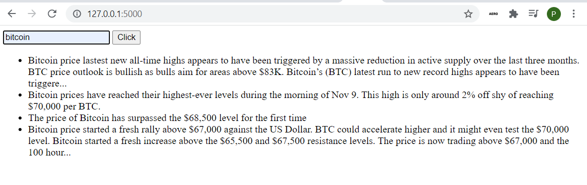

# Crypto_Currency_News_Page
### Installation 
In your terminal, install necesssary libraries:
```shell
pip install -r requirements.txt
```
Or you can do it in order:
```shell
pip install flask 
pip install flask_sqlalchemy
pip install requests
pip install selenium 
```
Create a table in advance to fill it later:
```sql
CREATE TABLE Paragraphs(
  id integer PRIMARY KEY,
  text VARCHAR
);
```
Run the application:
```
python3 test/main.py
```
### Usage
To use application provide a name of a existing cryptocurrency, and after refreshing it will scrap the news related to this currency.
### Example
<p align="center">
  
</p>
